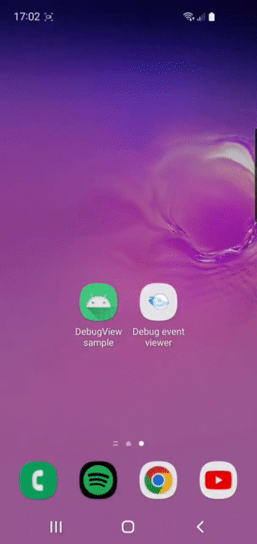

This is library in-app analytic event viewer.

Usually, I use logcat to debug analytic event values, I'm tired of connecting my device with my machine or even more checking it in the analytic dashboard.



Usage
-----

Two easy steps:

1. Call `DebugView#init` in the `onCreate` of your application class.
2. Call `DebugView#record` static method in your analytic method.

`DebugView#init` accepts list of TAG to differentiate your analytic, for example, if you have more than one analytic dep in your app.
`DebugView#record` accept `Event`. Each `Event` belong to your specific TAG.

Check out the sample app in `sample/` to see it in action.

Download
--------

```groovy
repositories {
    maven { url 'https://jitpack.io' }
}

dependencies {
    debugImplementation 'com.github.wisnukurniawan.analytics-debugview:debugview:0.1.1'
    releaseImplementation 'com.github.wisnukurniawan.analytics-debugview:debugview-no-op:0.1.1'
}
```
